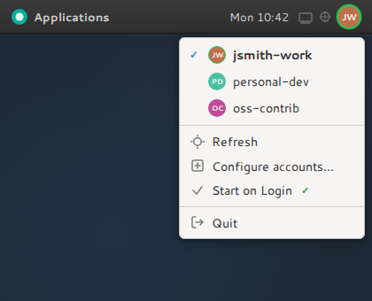

# github-account-switcher

A lightweight system tray app for switching between multiple GitHub accounts (`gh` CLI) with a single click. Each account can carry its own git identity (name + email), which is applied automatically on switch.



## Platform support

| Platform                              | Status       |
|---------------------------------------|--------------|
| Linux (X11, XApp-compatible desktop)  | ✓ Supported  |
| macOS                                 | Coming soon  |
| Windows                               | Coming soon  |

## Features

- System tray icon showing the active account's initials
- One-click account switching via `gh auth switch`
- Per-account git identity (`user.name` / `user.email`) applied on switch
- First-run auto-populates config from current `git config --global`
- Start on login (XDG autostart)

## Requirements

- Ubuntu 24.04+ / Debian 12+ (Python 3.12 required)
- [`gh` CLI](https://cli.github.com/) with at least one authenticated account
- System packages: `gir1.2-xapp-1.0`, `python3-gi`, `python3-gi-cairo`

## Installation

### From a release `.deb` (recommended)

Download the `.deb` from the [latest release](https://github.com/panthrocorp/github-account-switcher/releases/latest) and install with:

```bash
sudo apt install ./gh-switcher_<version>_amd64.deb
```

`apt` resolves the system package dependencies automatically. After installation, `gh-switcher` is available on your `PATH`.

### via curl

One-line install — fetches and runs the installer script:

```bash
curl -fsSL https://raw.githubusercontent.com/panthrocorp/github-account-switcher/main/install.sh | bash
```

Installs to `~/.local/share/gh-switcher` and links the binary to `~/.local/bin/gh-switcher`. Re-running upgrades to the latest release.

### via pipx

Requires system GTK/XApp bindings first, then install with `--system-site-packages` so the venv can access them:

```bash
sudo apt-get install -y gir1.2-xapp-1.0 python3-gi python3-gi-cairo
pipx install gh-switcher --system-site-packages
```

### via pip

For users who prefer full control over the install. Because `python3-gi` and `gir1.2-xapp-1.0` are system packages not available on PyPI, a plain `pip install gh-switcher` will fail at runtime on modern Ubuntu/Debian. Use a venv with `--system-site-packages` instead:

```bash
# System deps (once)
sudo apt-get install -y gir1.2-xapp-1.0 python3-gi python3-gi-cairo

# Create an isolated venv that can see the system GTK bindings
python3 -m venv --system-site-packages ~/.local/share/gh-switcher
~/.local/share/gh-switcher/bin/pip install gh-switcher
ln -sf ~/.local/share/gh-switcher/bin/gh-switcher ~/.local/bin/gh-switcher
```

### From source

```bash
# Install system dependencies
sudo apt-get install -y gir1.2-xapp-1.0 python3-gi python3-gi-cairo

# Clone and install
git clone https://github.com/panthrocorp/github-account-switcher.git
cd github-account-switcher
make install
```

Run it:

```bash
.venv/bin/gh-switcher
```

> The venv is created with `--system-site-packages` so the GTK/XApp bindings (system packages) are accessible.

## Usage

Launch `gh-switcher` — the tray icon appears in your system tray. Left-click (or right-click) to open the menu and select an account to switch.

Toggle **Start on Login** to add or remove the XDG autostart entry (`~/.config/autostart/gh-switcher.desktop`).

### Starting on login

The easiest way is via the tray menu — click **Start on Login** to toggle it. To do it manually, create the XDG autostart entry:

```bash
mkdir -p ~/.config/autostart
cat > ~/.config/autostart/gh-switcher.desktop <<EOF
[Desktop Entry]
Type=Application
Name=gh-switcher
Exec=gh-switcher
Hidden=false
NoDisplay=false
X-GNOME-Autostart-enabled=true
EOF
```

Remove the file to disable autostart.

## Configuration

On first run, `~/.config/gh-switcher/accounts.toml` is created automatically. The active account is populated from your current `git config --global`; other accounts get stub entries to fill in:

```toml
[alice]
name = "Alice Smith"
email = "alice@example.com"

[alice-work]
name = "Alice Smith (Work)"
email = "alice@work.example.com (set me)"
```

Click **Configure accounts...** in the tray menu to open the file in your default editor.

## Using with other git providers (Azure DevOps, GitLab, etc.)

gh-switcher writes `git config --global user.name` and `user.email` when you switch accounts. If you also work with repos hosted on other providers (e.g. Azure DevOps, GitLab, Bitbucket), the global identity set by gh-switcher will apply to those repos too.

To keep a separate identity for non-GitHub repos, use git's **conditional includes** (requires git 2.36+). This lets you scope an identity override by remote URL pattern, so gh-switcher can freely manage the global config without affecting your other repos.

### Example: Azure DevOps

Create an identity file:

```bash
mkdir -p ~/.config/git
cat > ~/.config/git/ado-identity <<EOF
[user]
    name = Your Name
    email = your.email@company.com
EOF
```

Add a conditional include to `~/.gitconfig`:

```gitconfig
[includeIf "hasconfig:remote.*.url:git@ssh.dev.azure.com:v3/your-org/**"]
    path = ~/.config/git/ado-identity
```

Any repo whose remote matches the pattern will use the identity from `ado-identity` instead of the global one. You can add multiple `includeIf` blocks for different providers or organisations.

### Example: GitLab

```gitconfig
[includeIf "hasconfig:remote.*.url:https://gitlab.com/your-org/**"]
    path = ~/.config/git/gitlab-identity
```

### Alternative: directory-based

If you keep provider repos in separate directories, you can scope by path instead:

```gitconfig
[includeIf "gitdir:~/repos/work/"]
    path = ~/.config/git/work-identity
```

## Development

```bash
make lint       # ruff check src/ tests/
make format     # ruff format src/ tests/
make test       # pytest + bats (test-py + test-bash)
make test-py    # pytest unit tests only
make test-bash  # bats shell tests only (install.sh)
```

## Releasing

Releases are driven by [semantic-release](https://semantic-release.gitbook.io/) via GitHub Actions on push to `main`. Commit messages must follow the convention:

| Prefix       | Release |
|--------------|---------|
| `fix:`       | patch   |
| `feat:`      | minor   |
| `breaking:`  | major   |

## Licence

[MIT](LICENSE)
